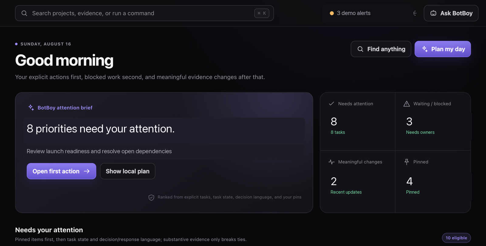
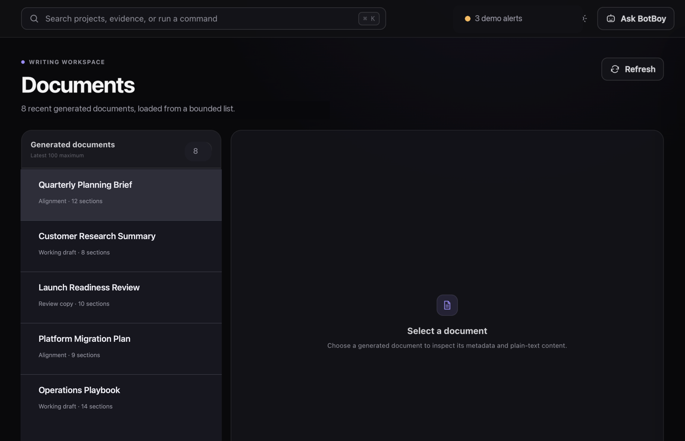
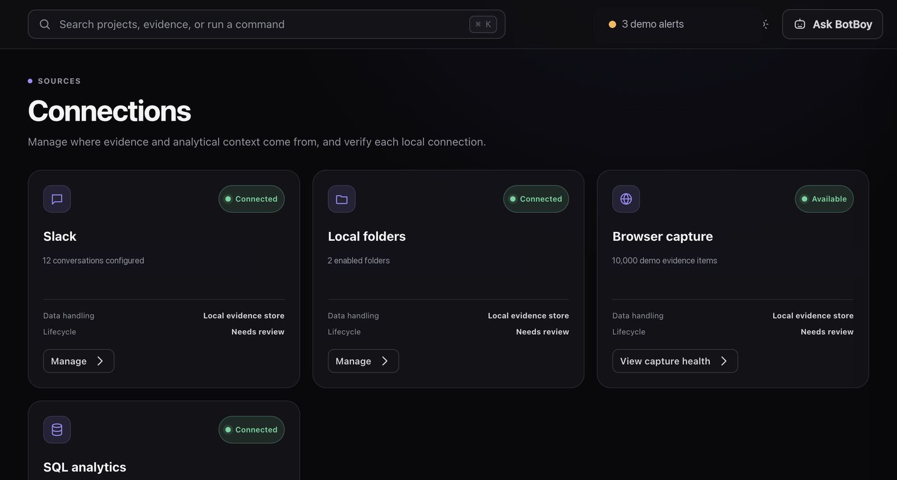
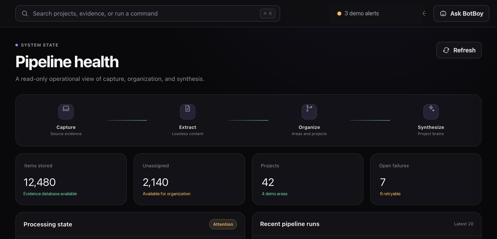

# BotBoy

Your local, private productivity brain for macOS. BotBoy watches the work you
choose to share with it — Slack, Outlook mail and calendar, SharePoint
documents, local folders, your browser — organizes everything into projects
with living, synthesized briefs, and gives you a chat assistant that actually
knows your work. Everything runs and stays on your Mac: captures, database,
and documents never leave your machine.

## Product tour

The screenshots use synthetic demo labels and obfuscated counts — no captured
workspace content, private messages, or personal data.

### Your day, prioritized

Open BotBoy and start from one screen: what needs your attention, who is
waiting on a reply from you, and what changed while you were away.



### Documents that know your projects

BotBoy syncs the SharePoint documents you work in (revisions, comments, open
threads), renders them in a built-in reader, and can draft or edit documents
for you — every change staged for your explicit approval before anything
touches SharePoint.



### Connections and pipeline, in the open

<table>
  <tr>
    <td width="50%"></td>
    <td width="50%"></td>
  </tr>
  <tr>
    <td align="center"><strong>Connections</strong><br />Slack channels, Outlook/SharePoint, local folders, and browser capture — each one opt-in, configured from the dashboard.</td>
    <td align="center"><strong>Pipeline health</strong><br />Read-only visibility into capture, extraction, organization, and synthesis, so you always know what BotBoy is doing.</td>
  </tr>
</table>

## What you get

- **Capture without note-taking** — Slack messages in channels you pick,
  Outlook mail and calendar, SharePoint document revisions and comments,
  files in watched folders, and pages you visit. All opt-in, all local.
- **Projects that assemble themselves** — captured evidence is routed into
  project briefs that stay current as work happens, with the receipts one
  click away.
- **A chat assistant with context** — ask "what needs my attention?", "what
  changed in the HLD?", or "draft a status update" and get answers grounded
  in your own evidence, with links back to sources.
- **Approval-gated writes** — BotBoy never edits a SharePoint document or
  publishes anything without a staged change you explicitly approve first.

## Prerequisites

- macOS (Apple Silicon or Intel)
- Node.js 20+ (`node --version`)
- A personal credentials file from the owner (one download link — no AWS
  account or cloud setup needed)

## Install

```bash
git clone https://github.com/ybhagaab/botboy-app.git
cd botboy-app
./start.sh
```

First launch installs dependencies and builds automatically (a few minutes),
then opens the dashboard at `http://localhost:7778`. Full steps — credentials,
connecting your data sources, the optional Dock app — are in
**[docs/TEAMMATE_SETUP.md](docs/TEAMMATE_SETUP.md)**.

## Update

```bash
git pull
./start.sh
```

The launcher detects the new version and rebuilds on its own.

## Privacy

BotBoy is single-user and local-first. Your evidence database, document
copies, and credentials live in `~/.personal-productivity-tracker/` on your
Mac — not in this repository, and not on any shared server. The only network
calls are to the sources you connect and to the team's authenticated LLM
gateway for synthesis. Deleting that folder removes everything.

## Help

Run `./start.sh --doctor` and send the output to the owner. It checks Node,
build state, native modules, credentials, the port, and the served UI, and
includes the recent log lines.

---
*This repository is the app distribution. It receives release snapshots; development happens elsewhere.*
