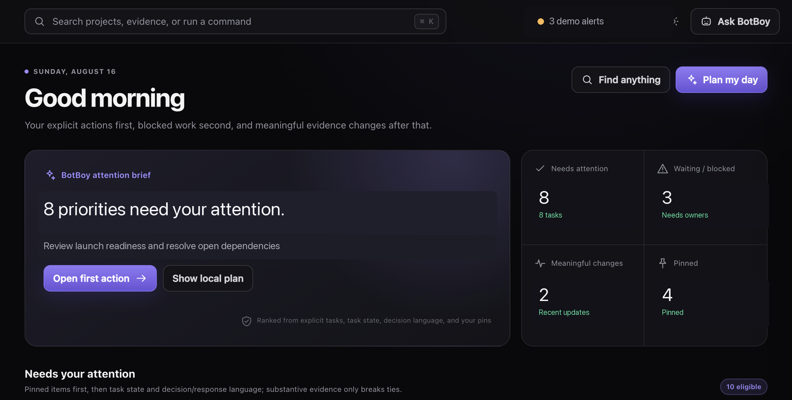
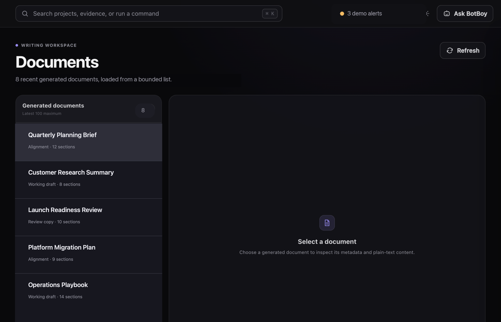
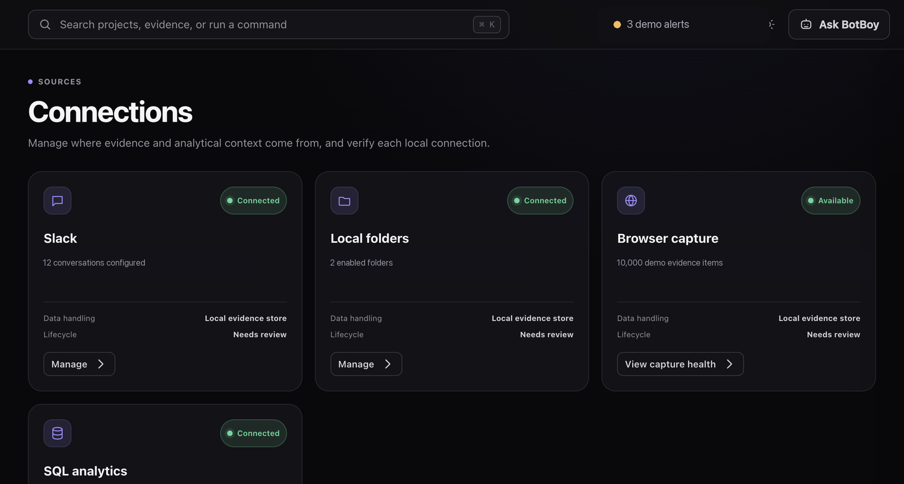
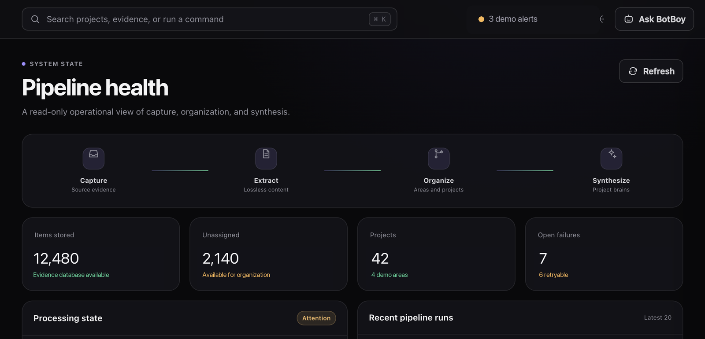

# BotBoy

**Stop assembling your own context. Start every day already caught up.**

BotBoy is a local-first productivity brain for your Mac. It watches the work
you choose to share with it—Slack, Outlook, SharePoint, DataCentral ETL jobs,
local folders, and your browser—and turns that activity into organized
projects, living briefs, and a chat assistant grounded in your work. Evidence,
document copies, generated files, and credentials stay local by default;
selected content needed for LLM requests goes through the authenticated team
gateway, or to OpenAI or DeepSeek under your own account when you add an API
key in Settings → AI model and choose one of its models.

## Why teams use it

**The context tax is real.** Every week you re-read threads to remember where
a decision landed, re-open documents to check what changed, and re-download
the same report outputs to build the same deck. BotBoy pays that tax for you:
it captures as work happens, files evidence into the right project, keeps each
project's brief current, and hands you the receipts when you ask.

## Product tour

The screenshots use synthetic demo labels and obfuscated counts—no captured
workspace content, private messages, or personal data.

### Your day, prioritized

BotBoy's Today view groups priorities and blockers by project while meaningful
changes use concise, evidence-backed summaries. Less clutter, more context,
faster action.



### Documents that know your projects

BotBoy syncs the SharePoint documents you work in—revisions, comments, open
threads—renders them in a built-in reader, and drafts or edits documents on
request. Every change is staged for explicit approval before anything touches
SharePoint.



### Your ETL jobs, without the tab-juggling

Ask about a Datanet job run, paste a run URL, or ask BotBoy to fetch report
outputs and assemble the final file. Submitting, restarting, or creating ETL
work happens only when you explicitly ask; heavyweight warehouse SQL uses its
dedicated read-only analytics connection.

### Connections and pipeline, in the open

<table>
  <tr>
    <td width="50%"></td>
    <td width="50%"></td>
  </tr>
  <tr>
    <td align="center"><strong>Connections</strong><br />Slack, Outlook/SharePoint, Datanet ETL, warehouse SQL, local folders, and browser capture—each opt-in and guided from the dashboard.</td>
    <td align="center"><strong>Pipeline health</strong><br />Read-only visibility into capture, extraction, organization, and synthesis.</td>
  </tr>
</table>

## What you get

- **Capture without note-taking** — capture only the sources you enable.
- **Projects that assemble themselves** — evidence routes into living project
  briefs with links back to sources.
- **A chat assistant with your context** — ask what needs attention, what
  changed, or for a draft grounded in your own evidence.
- **Analytics on tap** — governed read-only SQL, refreshable dashboards, and
  Datanet result downloads.
- **Writes you approve** — BotBoy does not publish documents, send messages,
  or change production pipelines without an explicit request and the relevant
  review boundary.

## Install

You need macOS, Google Chrome, Git, Node.js 20.16+, and an AI model: the private
BotBoy credential attachment sent by the owner, your own OpenAI API key, your
own DeepSeek API key, or any mix of them. No AWS account or `aws login` is
required. Homebrew's current Node (`brew install node`, Node 26 with npm 12)
works; on Node 20, `npm install` builds the database module from source and
needs Xcode Command Line Tools (`xcode-select --install`).

If you have a credential attachment, download it to Downloads or Desktop.
Then run:

```bash
git clone https://github.com/ybhagaab/botboy-app.git ~/botboy-app
cd ~/botboy-app
npm install
./start.sh
```

Using your own OpenAI or DeepSeek API key? When the dashboard opens, go to
**Settings → AI model**, paste the key into its card, and choose **Save and
turn on**. BotBoy checks it with the provider and offers its models right away,
with no restart. The chat panel lists every connected provider's models, and
**Background work** chooses the models for organizing and document writing.

Allow a few minutes on first run. BotBoy imports any credential attachment
(`.env` or owner-issued ZIP), builds itself, waits for the final dashboard to
be usable, opens it, and attempts to install `BotBoy.app` in Applications. A
successful Terminal start ends with `✅ Dashboard ready:`. If startup instead
reports a failure, do not keep refreshing Chrome—run `./start.sh --doctor` and
review the named `/tmp/ppt.log` evidence. Detailed connections and support
steps are in **[docs/TEAMMATE_SETUP.md](docs/TEAMMATE_SETUP.md)**.

## Update

```bash
cd ~/botboy-app
./start.sh --update
```

Always use this updater instead of `git pull`. It preserves compatible tracked
customizations, saves overlaps for deliberate reapplication, and never removes
untracked files or home-directory evidence.

If an old process exited without a DB-last receipt, BotBoy blocks replacement
rather than guessing that SQLite closed cleanly. Deleting and re-cloning
`botboy-app` does not clear this: the guard and the database live outside the
checkout. Do not delete the guard yourself; run the explicit recovery, which
also tells you if an old BotBoy is still running. While the guard exists,
`./start.sh --update` brings the new release without starting it:

```bash
cd ~/botboy-app
./start.sh --update            # code only while the guard exists
./start.sh --doctor
./start.sh --recover-shutdown
./start.sh
```

Recovery runs only on a stopped database, makes and verifies an exact private
DB/WAL/SHM snapshot, archives the guard, and never calls the old exit clean. It
needs no `npm install`, and a start that fails before BotBoy opens its database
leaves no guard. If an older updater answers **Update paused**, move the
checkout aside and clone again (see the setup guide); your data stays in
`~/.personal-productivity-tracker/`.

## Privacy

BotBoy is single-user and local-first. Its evidence database, document copies,
generated files, and credentials live under
`~/.personal-productivity-tracker/`. Selected text and bounded visual inputs
needed for LLM requests go through the authenticated team gateway, or to OpenAI
or DeepSeek under your own account when one of your saved keys' models does the
work (Data Room table values are never sent to them). Connections communicate only
with services you enable; explicit writes keep their own approval boundaries.

## Help

```bash
cd ~/botboy-app
./start.sh --doctor
```

Doctor checks the environment, build, credential status, listener, UI, and a
recent log tail. It never prints credentials or tokens, but review the report
for internal titles, paths, or work context before sharing it with the owner.

---
*This repository is the app distribution. It receives release snapshots; development happens elsewhere.*
